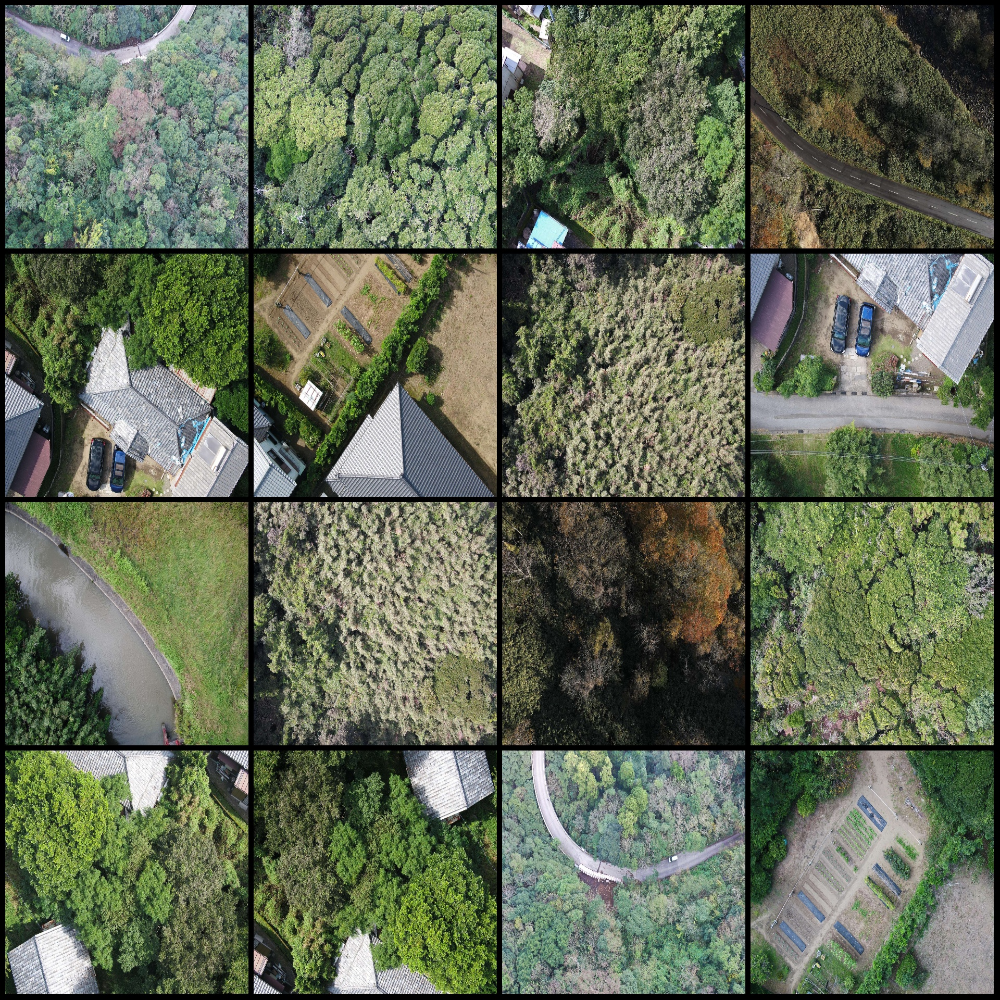
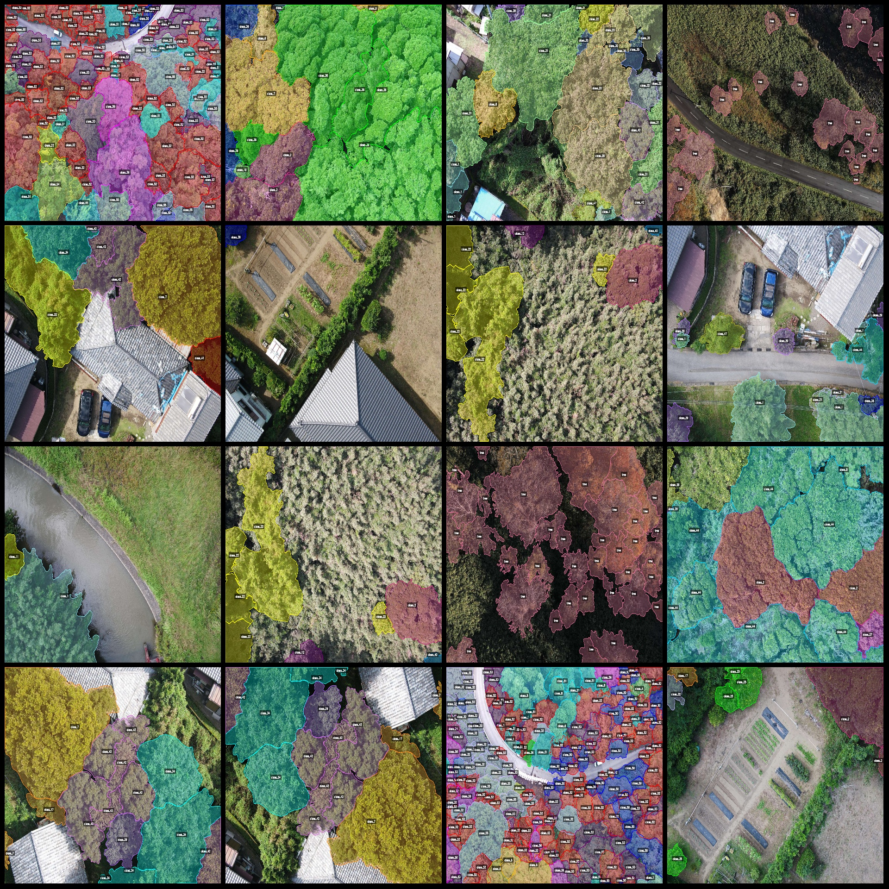
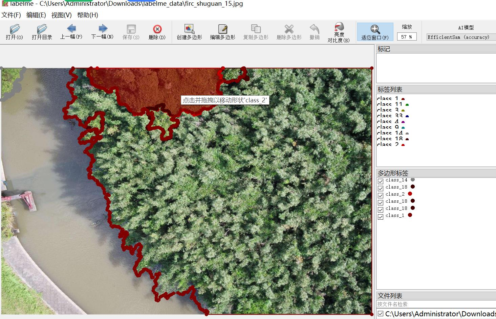

# Drone-View Tree Canopy Segmentation Dataset with LabelMe Format and 1,288 Images in 59 Categories

To address the issue of having many small crowns represented by class1, and since there are too many species to list them all, we can simplify by renaming the class number to a single name for the crown. Here, we will also refine the annotation process during the dataset preparation.

The dataset format should be in LabelMe format (excluding the mask file, only including JPG images and their corresponding JSON files).
number of images: 1288  
annotation count: 1288  
annotationnumber of classes: 59  
annotation class names:["class_1","class_11","class_3","class_28","class_15","class_18","class_7","class_5","class_12","class_24","class_38","class_4","class_55","class_51","class_53","class_52","class_57",
"class_50","class_56","class_44","class_58","class_32","class_34","class_49","class_46","class_29","class_43","class_8","class_48","class_20","class_40","class_45","class_23","class_39","class_42",
"class_6","class_14","class_22","class_37","class_26","class_16","class_35","class_17","class_2","tree","class_33","class_9","class_31","class_13","class_19","class_27","class_25","class_41",
"class_30","class_36","class_10","class_47","class_21","class_54"]  
boxes per class:   
class_1 count = 1724  
class_11 count = 263  
class_3 count = 184  
class_28 count = 381  
class_15 count = 1347  
class_18 count = 498  
class_7 count = 729  
class_5 count = 194  
class_12 count = 262  
class_24 count = 102  
class_38 count = 267  
class_4 count = 541  
class_55 count = 1500  
class_51 count = 2372  
class_53 count = 4555  
class_52 count = 6213  
class_57 count = 189  
class_50 count = 1558  
class_56 count = 1273  
class_44 count = 790  
class_58 count = 354  
class_32 count = 1478  
class_34 count = 246  
class_49 count = 501  
class_46 count = 245  
class_29 count = 669  
class_43 count = 168  
class_8 count = 785  
class_48 count = 65  
class_20 count = 378  
class_40 count = 214  
class_45 count = 94  
class_23 count = 342  
class_39 count = 79  
class_42 count = 292  
class_6 count = 148  
class_14 count = 141  
class_22 count = 817  
class_37 count = 159  
class_26 count = 104  
class_16 count = 416  
class_35 count = 159  
class_17 count = 53  
class_2 count = 683  
tree count = 7850  
class_33 count = 50  
class_9 count = 19  
class_31 count = 313  
class_13 count = 158  
class_19 count = 107  
class_27 count = 250  
class_25 count = 160  
class_41 count = 223  
class_30 count = 161  
class_36 count = 457  
class_10 count = 33  
class_47 count = 160  
class_21 count = 73  
class_54 count = 66
## Image

Here is a pay link on Stripe ( https://buy.stripe.com/3cs8yP7sY87d0vu9AB ). Please contact me lonlonago@foxmail.com after funding $89, and I will send you a complete data files , thank you!

